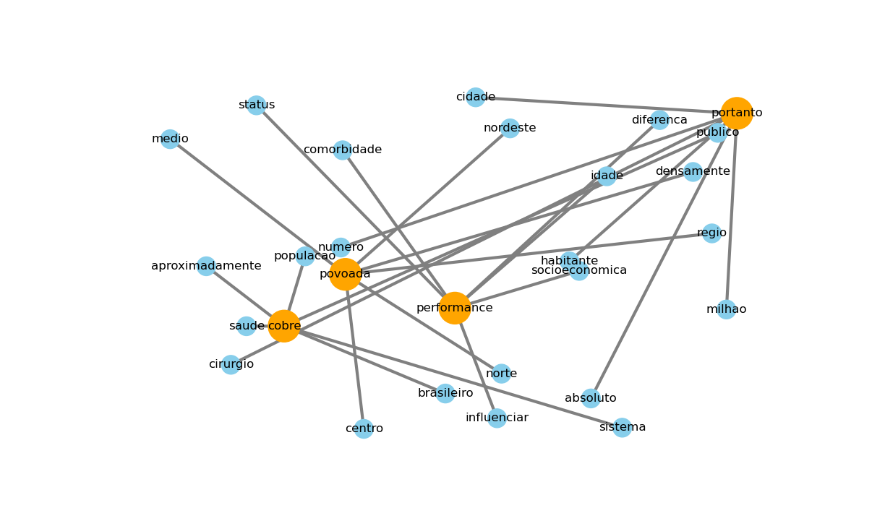

# Primeiro Projeto do Bootcamp do Instituto Atlântico 

### Desenvolvido pelos alunos do Squad2:
Airton, Ícaro e Leandro

## O Projeto

Para executar o projeto clone o repositório e use o pipinstall com o arquivo requirements.
Para executá-lo, abrir o main.py e rodar.
O projeto está todo customizável e adaptável. A quantidade de nós, quantas palavras vizinhas, leitura de quaisquer arquivos com extensão .PDF.
Também foi usado classe (obj), módulos Python para chamadas. Todo arquivo Python possui docstring explicando os parâmetros de entrada e saída dos métodos e funções. Também estão explicitamente informados os tipos (Data Type) de cada variável nas funções/classes. 
## Introdução

Projeto criado com o objetivo de apresentar, com base em NLP, uma visão geral do histórico de um paciente sem a necessidade de analisar documento por documento referentes a histórico de exames, consultas e procedimentos.

### Sumário da solução

1. [Dataset](#section01)
   
2. [Pré-processamento dos dados](#section02)
  
3. [Lematização](#section03)

4. Determinar com base nos resultados da lematização:

    4.1 Term Frequency 
    4.2 Document Frequency 
    4.3 Inverse Document Frequency 
    4.4 TF-IDF 
    
 5. Gerar um arquivo csv que possui todas as palavras de todos os documentos na primeira coluna
 6. [Resultado em Nuvem de palavras](#section04)
 7. [Tópicos de Auxílio](#section05)
   

### Dataset
Como base dados foram utilizados 3 documentos com histórico de consultas no formato pdf de um paciente.

### Pré-processamento dos dados
Para os dados foram aplicados processamento como tokenização e remoção de stop words e transformar os caracteres todos em minúsculos.

### Lematização
Tendo os dados já processados realizou-se a lematização com a biblioteca Stanza.

### Resultado em nuvem de palavras

### Tópicos de Auxílio

**TF-IDF**
https://towardsdatascience.com/tf-idf-for-document-ranking-from-scratch-in-python-on-real-worlddataset-796d339a4089

**Informações sobre as métricas utilizadas**
https://www.kaggle.com/arthurtok/ghastly-network-and-d3-js-force-directed-graphs

**Atividade determinação da nuvem de palavras**
http://andrewtrick.com/stormlight_network.html
